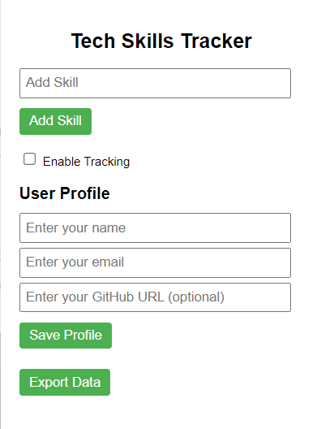
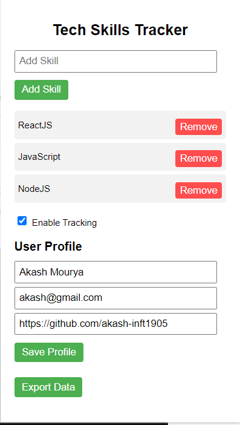
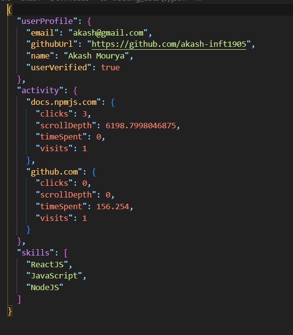

# Technology Skills Tracker Chrome Extension


## Table of Contents

- [Overview](#overview)
- [Features](#features)
- [Screenshots](#screenshots)
- [Installation](#installation)
- [Usage](#usage)
- [User Verification](#user-verification)
- [Data Storage](#data-storage)
- [Acknowledgments](#acknowledgments)
- [License](#license)

## Overview

The **Technology Skills Tracker** Chrome extension is designed to help users track their technology skills based on their browsing habits. The extension collects data about websites visited, time spent, and scroll depth to provide insights into users' interests and skill development.

## Features

- **Skill Addition:** Users can manually add skills they want to track.
- **Tracking Control:** Enable or disable tracking of browsing habits.
- **Data Export:** Export collected data in JSON format for external analysis.
- **Profile Management:** Users can manage their profiles, including:
  - Name
  - Email
  - GitHub URL (optional)
- **User Verification:** Validate the GitHub URL to verify user identity.
- **Local Storage Management:** Data is stored locally for offline access.
- **Acknowledgments:** Notifications after profile saving to enhance user experience.

## Screenshots


_Home Screen_


_After Filling Data Screen_


_Skill Tracking_

## Installation

1. Clone this repository to your local machine.
   ```bash
   git clone https://github.com/your-username/technology-skills-tracker.git
   ```
2. Navigate to the project directory.
   ```bash
   cd technology-skills-tracker
   ```
3. Open Chrome and navigate to `chrome://extensions/`.
4. Enable "Developer mode" at the top right corner.
5. Click "Load unpacked" and select the project directory.

## Usage

1. Click the extension icon in the Chrome toolbar.
2. Fill in your name, email, and optional GitHub URL.
3. Click "Verify" to check the validity of your GitHub URL.
4. Click "Save Profile" to store your information.
5. Enable tracking to start monitoring your browsing habits.
6. Access the "Export Data" feature to save your tracked data.

## User Verification

To verify the user identity, input a valid GitHub URL in the provided field. If the URL is correct, the profile will reflect that verification status. This feature ensures that the data is associated with legitimate users.

## Data Storage

Data collected during tracking is stored locally in the browser's storage. Users can export this data in JSON format, which can then be used for further analysis or record-keeping.

## Acknowledgments

We would like to thank everyone who contributed to this project. Special thanks to the open-source community for their invaluable resources.

## License

This project is licensed under the MIT License. See the [LICENSE](LICENSE) file for details.
